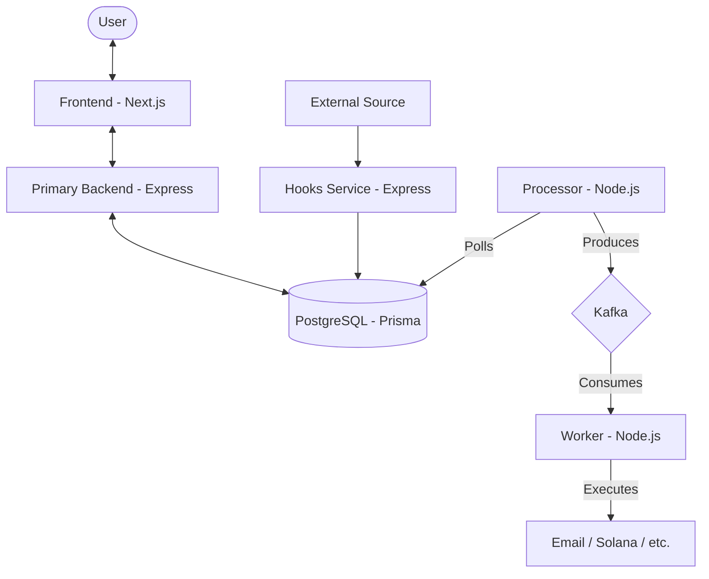
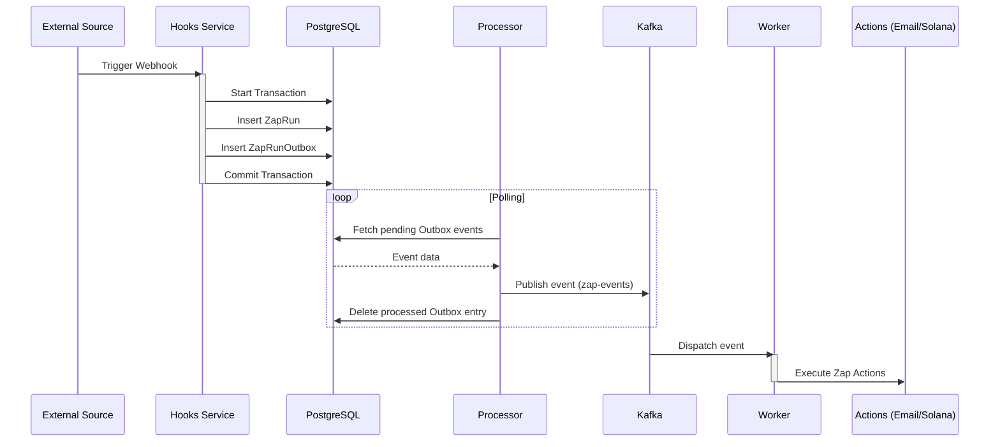

# TriggerHub

TriggerHub is a Zapier-like automation platform designed to handle event-driven workflows with a robust microservices architecture. It integrates with webhooks, Kafka for event streaming, and Prisma for database management.

## Description
TriggerHub is built to simplify complex automation workflows by allowing users to create custom triggers and actions seamlessly. The platform is structured with a microservices architecture, ensuring that each component (frontend, backend, hooks, processor, worker) operates independently for optimal performance and scalability. Leveraging the power of Kafka for real-time data streaming and Prisma ORM for efficient database interactions, TriggerHub offers a highly responsive and fault-tolerant environment. 

The platform supports:
- **Custom Webhooks:** Enabling integration with third-party APIs for dynamic data exchange.
- **Event Processing:** Kafka ensures real-time event streaming and processing with high throughput.
- **Workflow Automation:** Design and manage workflows through user-friendly interfaces, powered by Next.js and React.
- **Robust Data Management:** PostgreSQL and Prisma handle data integrity and scalability effortlessly.

## Features
- **Event-Driven Architecture:** Seamless handling of triggers and actions.
- **Microservices:** Decoupled services for better scalability.
- **Real-Time Processing:** Kafka-powered asynchronous message processing.
- **Flexible Webhooks:** Custom hooks for external integrations.
- **Secure Authentication:** JWT-based secure user authentication and authorization.
- **Fault Tolerance:** Ensures reliable event processing with Kafka consumer groups and retries.

##  Tech Stack
- **Frontend:** Next.js, React, TypeScript, TailwindCSS, Axios, React-flow
- **Backend:** Node.js, Express, Prisma, PostgreSQL
- **Event Streaming:** Kafka
- **Database:** PostgreSQL with Prisma ORM
- **Dev Tools:** ESLint, TypeScript, Docker

## What it does? 
It includes Webhook as trigger and email and solana transaction with some metadata as email address, comment 

## 📦 Installation
### Prerequisites
- Node.js
- PostgreSQL
- Kafka (for event streaming)

### Clone the Repository
```bash
git clone https://github.com/Amitaarav/TriggerHub.git
cd TriggerHub
```

### Install Dependencies
For **Frontend**:
```bash
cd frontend
npm install
```
For **Backend (Primary & Hooks)**:
```bash
cd primbackend
npm install

```
### Hooks
```
cd ../hooks
npm install
```
For **Processor & Worker**:
```bash
cd processor
npm install
cd ../worker
npm install
```

## ⚙️ Configuration
Create a `.env` file in each service directory with necessary environment variables:
```env
DATABASE_URL=your_postgresql_url
REDIS_URL=your_redis_url
KAFKA_BROKERS=localhost:9092
JWT_PASSWORD=your_secret_password
PORT=3000
```

## 🚀 Running the Application
### Start Kafka (Ensure Kafka is running locally or remotely)
```bash
# Start Kafka broker (if using Docker)
docker-compose up -d
```

### Start All Services
```bash
# Frontend
cd frontend
npm run dev

# Primary Backend
cd ../primbackend
npm run dev

# Hooks Backend
cd ../hooks
npm run dev

# Processor
cd ../processor
npm run dev

# Worker
cd ../worker
npm run dev
```

## 🧪 Running Tests
```bash
npm run test
```

## System Architecture



## Trigger Flow (Transactional Outbox Pattern)



## 🗂️ Project Structure
```
TriggerHub/
├── frontend/          # React + Next.js Frontend
├── primbackend/       # Primary Backend API
├── hooks/             # Webhook Management Service
├── processor/         # Kafka Event Processor
└── worker/            # Kafka Event Worker
```


## Schema: 
```
    User ───< Zap ───< Action >─── AvailableActions
         │  │
         │  └─── Trigger >─── AvailableTriggers
         │
         └───< ZapRun ─── ZapRunOutbox
```
### Prisma Data Model Relationships

- User ↔ Zap:

One-to-Many → A User can have multiple Zaps.

Many-to-One → Each Zap belongs to exactly one User.

- Zap ↔ Trigger:

One-to-One (optional) → Each Zap can have at most one Trigger.

- Zap ↔ Action:

One-to-Many → A Zap can have multiple Actions.

- Zap ↔ ZapRun:

One-to-Many → A Zap can have multiple ZapRuns (each execution instance of the Zap).

- Trigger ↔ AvailableTriggers:

Many-to-One → Each Trigger is associated with exactly one AvailableTrigger type.

- Action ↔ AvailableActions:

Many-to-One → Each Action is associated with exactly one AvailableAction type.

- ZapRun ↔ ZapRunOutbox:

One-to-One (optional) → Each ZapRun may have one ZapRunOutbox entry for reliable event dispatching.

## Instrunction for mapping
- ───< = One-to-Many

- ─── = One-to-One

- >─── = Many-to-One

### Hooks
- Hook trigger is built to shoot a webhook link. 

- Generally:
## Webhooks for Backend Communication

- Webhooks enable seamless communication between two backend systems. For example, consider Stripe or Razorpay. Banks typically expose their APIs only to trusted intermediaries like Razorpay. In this setup:

- Razorpay registers a webhook endpoint (e.g., create-secret-url) with the bank’s backend (such as HDFC).

- Whenever a payment occurs, the bank notifies Razorpay by calling this webhook.

- If the payment succeeds, Razorpay in turn sends a webhook notification to the main application’s backend, ensuring that the application is always updated with the latest payment status.

## Processor
- Processor pushes data to kafka topic named "zap-events" with key "zap" and value as the event data. 

### Transactional outbox pattern
- To ensure atomicity in the trigger flow, I implemented the Transactional Outbox Pattern. This microservice design pattern separates the database into two tables: one for primary business data and another as the outbox for events. When a webhook trigger is received, the data is written to both tables within the same transaction. An always-running Node.js processor continuously polls the outbox table, batching events and publishing them reliably to the Kafka queue.

## Benefits of the Transactional Outbox Pattern

1. - No 2PC overhead – avoids the complexity and performance cost of `two-phase commit`.

2. - Guaranteed delivery – messages are published only if the database transaction commits successfully.

3. - Preserves ordering – messages are sent to the broker in the `exact sequence` they were generated by the application.

## Drawbacks of the Transactional Outbox Pattern

1. Developer oversight risk – This pattern can be error-prone if a developer forgets to publish the event/message after updating the database.

2. Possible duplicate messages – The message relay may publish the same event more than once. For example, it might crash after publishing a message but before recording that it has been processed. Upon restarting, it could republish the same message.

3. To handle this, message consumers must be idempotent, often by tracking the IDs of already-processed messages.

Fortunately, idempotency is a common requirement anyway, since message brokers themselves may deliver the same message more than once.

## Worker
-Worker pulls and listens to the "zap-events" topic and processes the events.


---

Made by [Amit Kumar Gupta](https://github.com/Amitaarav)


