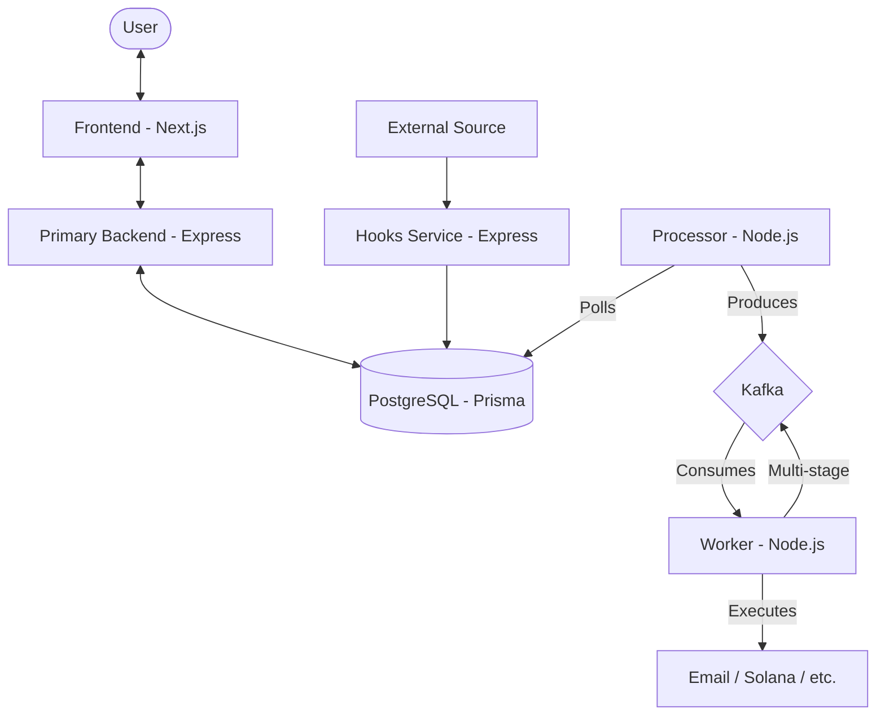

# TriggerHub 🚀

TriggerHub is a production-grade automation platform (inspired by Zapier) designed to handle complex, event-driven workflows at scale. It leverages a modern microservices architecture, implementing industry-standard patterns like the **Transactional Outbox Pattern** to ensure data consistency and high reliability.

---

## 📝 Project Overview

TriggerHub is built to simplify complex automation workflows by allowing users to create custom triggers and actions seamlessly. The platform ensures that each component operates independently for optimal performance and scalability. Leveraging the power of Kafka for real-time data streaming and Prisma ORM for efficient database interactions, TriggerHub offers a highly responsive and fault-tolerant environment.

### The platform supports:
- **Custom Webhooks:** Enabling integration with third-party APIs for dynamic data exchange.
- **Event Processing:** Kafka ensures real-time event streaming and processing with high throughput.
- **Workflow Automation:** Design and manage workflows through user-friendly interfaces, powered by Next.js and React.
- **Robust Data Management:** PostgreSQL and Prisma handle data integrity and scalability effortlessly.
- **Solana Integration:** Trigger actions on the Solana blockchain with ease.

### ✨ Key Features
- **Event-Driven Architecture:** Seamless handling of triggers and actions.
- **Microservices:** Decoupled services for better scalability.
- **Real-Time Processing:** Kafka-powered asynchronous message processing.
- **Flexible Webhooks:** Custom hooks for external integrations.
- **Secure Authentication:** JWT-based secure user authentication and authorization.
- **Fault Tolerance:** Ensures reliable event processing with Kafka consumer groups and retries.

---

## 🏗️ System Architecture

TriggerHub is built as a distributed system of decoupled microservices:

- **Frontend:** Next.js application for workflow orchestration and management.
- **Primary Backend:** REST API for CRUD operations on Zaps (workflows), user authentication, and system configuration.
- **Hooks Service:** A high-throughput service dedicated to receiving external webhooks and persisting them safely.
- **Processor:** A background service that implements the Outbox pattern, moving data from the persistent store to the message broker.
- **Worker:** The execution engine that consumes events and interacts with third-party APIs (Email, Solana, etc.).

### High-Level Design



---

## 💎 Key System Design Concepts

### 1. Transactional Outbox Pattern
To ensure **atomic consistency** between the database and the message broker, TriggerHub implements the Transactional Outbox Pattern. 

- **Problem:** In a distributed system, "Dual Writes" (writing to a DB and then sending a message) are dangerous. If the DB write succeeds but the message broker call fails, the system becomes inconsistent.
- **Solution:** When a webhook hits the `Hooks` service, it saves the event into a `ZapRun` table AND a `ZapRunOutbox` table within a **single database transaction**.
- **Delivery:** The `Processor` then polls the `Outbox` table and publishes messages to Kafka. Only after a successful publish is the outbox entry marked as processed. This guarantees **At-Least-Once Delivery**.

### 2. Multi-Stage Workflow Execution
Workflow execution is handled in stages to allow for complex, multi-step automations.
- After a Worker completes a stage (e.g., sending an email), it checks if there are remaining actions.
- If more actions exist, it publishes a new event back to Kafka with `stage: n + 1`.
- This ensures that a single long-running zap doesn't block other tasks and allows the system to remain highly responsive.

### 3. Kafka as the Backbone
We chose Kafka over simpler queues (like RabbitMQ) for:
- **Persistence:** Messages can be replayed if a worker fails.
- **Throughput:** Capable of handling millions of events per second.
- **Decoupling:** Producers and consumers can scale independently.

---

## ⚖️ Tradeoffs & Design Decisions

| Feature | Choice | Tradeoff |
| :--- | :--- | :--- |
| **Data Consistency** | Transactional Outbox | **Benefit:** Guaranteed consistency. **Cost:** Increased database load due to continuous polling and extra table writes. |
| **Message Broker** | Kafka | **Benefit:** High throughput and durability. **Cost:** Operational complexity compared to Redis Pub/Sub or SQS. |
| **Execution** | Multi-stage Workers | **Benefit:** Horizontal scalability and fault tolerance for long-running tasks. **Cost:** Higher latency between steps due to re-queuing. |
| **CDC vs. Polling** | Polling | **Benefit:** Simpler to implement and requires no DB plugins. **Cost:** Higher latency than CDC (Change Data Capture) tools like Debezium. |

---

## 📈 Scalability Strategy

TriggerHub is designed to scale horizontally across every tier:

1.  **Hooks Service:** Stateless and can be scaled behind a Load Balancer to handle spikes in incoming webhooks.
2.  **Processor:** Can be scaled using **Database Partitions** or **Advisory Locks** to ensure multiple processor instances don't process the same outbox entries simultaneously.
3.  **Worker:** Scaled horizontally using **Kafka Consumer Groups**. Adding more workers automatically redistributes the partitions.
4.  **Database:** PostgreSQL can be scaled via Read Replicas for the Primary Backend.

---

## 📂 Project Structure
```
TriggerHub/
├── frontend/          # React + Next.js Frontend
├── primbackend/       # Primary Backend API (REST)
├── hooks/             # Webhook Management Service
├── processor/         # Transactional Outbox Processor
└── worker/            # Kafka Event Execution Worker
```

---

## 📊 Database Schema & Relationships

### Data Model Overview
```
    User ───< Zap ───< Action >─── AvailableActions
          │  │
          │  └─── Trigger >─── AvailableTriggers
          │
          └───< ZapRun ─── ZapRunOutbox
```
*Note: `───<` = One-to-Many, `───` = One-to-One, `>───` = Many-to-One*

### Key Relationships
- **User ↔ Zap:** One-to-Many. A user manages multiple automation workflows.
- **Zap ↔ Trigger:** One-to-One. Each workflow is initiated by exactly one trigger event.
- **Zap ↔ Action:** One-to-Many. A single trigger can fire a sequence of multiple actions.
- **ZapRun ↔ ZapRunOutbox:** One-to-One (optional). Ensures reliable event dispatching via the Outbox pattern.

---

## 🔌 Deep Dive: Component Details

### Webhooks for Backend Communication
Webhooks enable seamless communication between two backend systems. For example, consider a payment provider like Stripe:
1. The payment provider registers a webhook URL with the bank.
2. When a transaction occurs, the bank notifies the provider via the webhook.
3. If successful, the provider notifies **TriggerHub**, which then initiates the user's defined "Zap".

### The Processor
The Processor is a critical link in the Transactional Outbox Pattern. It ensures that no events are lost between the database and Kafka by continuously polling the `ZapRunOutbox` table and publishing to the `zap-events` topic.

### The Worker
The Worker is the "actor" of the system. It listens to Kafka, parses event metadata, and executes the business logic (e.g., sending emails via SMTP or executing Solana transactions via web3.js).

---

## 📦 Installation & Setup

### Prerequisites
- Node.js (v18+)
- Docker & Docker Compose
- PostgreSQL

### 1. Clone the Repository
```bash
git clone https://github.com/Amitaarav/TriggerHub.git
cd TriggerHub
```

### 2. Install Dependencies
```bash
# Frontend
cd frontend && npm install

# Backend Services
cd ../primbackend && npm install
cd ../hooks && npm install
cd ../processor && npm install
cd ../worker && npm install
```

### 3. Configuration
Create a `.env` file in each service directory (or a root one if using a monorepo manager):
```env
DATABASE_URL=your_postgresql_url
KAFKA_BROKERS=localhost:9092
JWT_PASSWORD=your_secret_password
```

### 4. Running the Application
```bash
# Start Infrastructure (Kafka, Postgres)
docker-compose up -d

# Start Services (in separate terminals)
npm run dev --prefix frontend
npm run dev --prefix primbackend
npm run dev --prefix hooks
npm run dev --prefix processor
npm run dev --prefix worker
```

---

Made with ❤️ by [Amit Kumar Gupta](https://github.com/Amitaarav)
